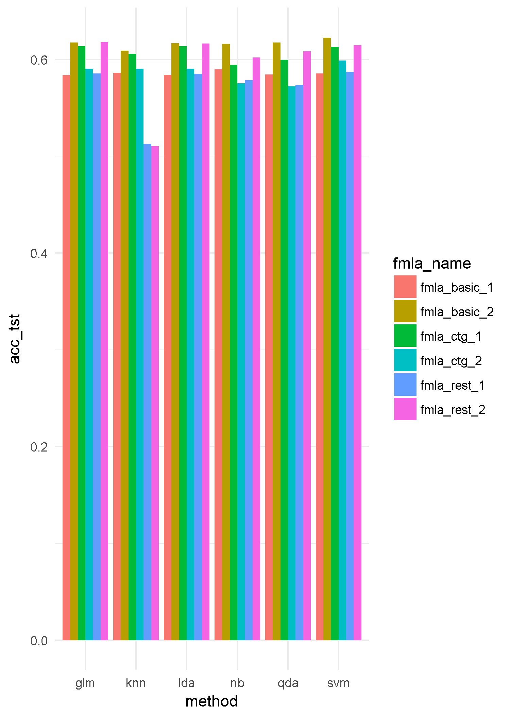
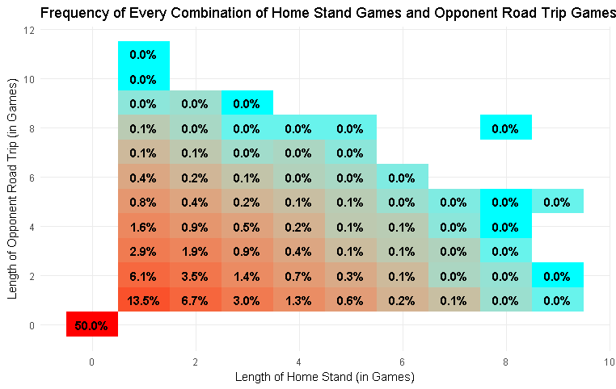
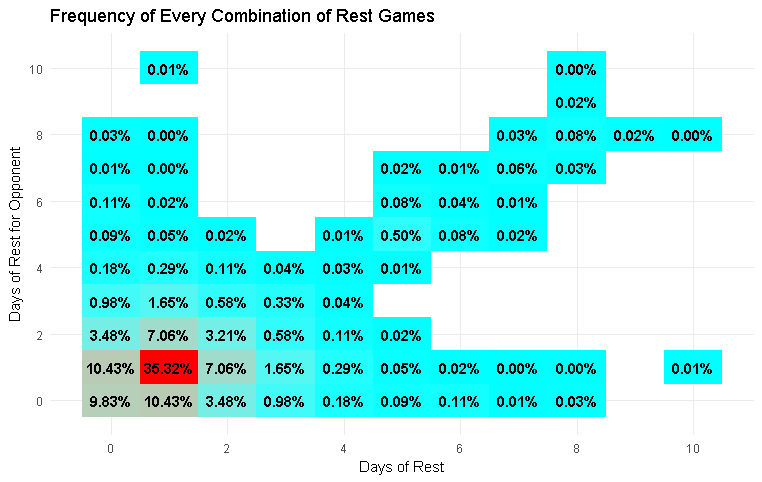
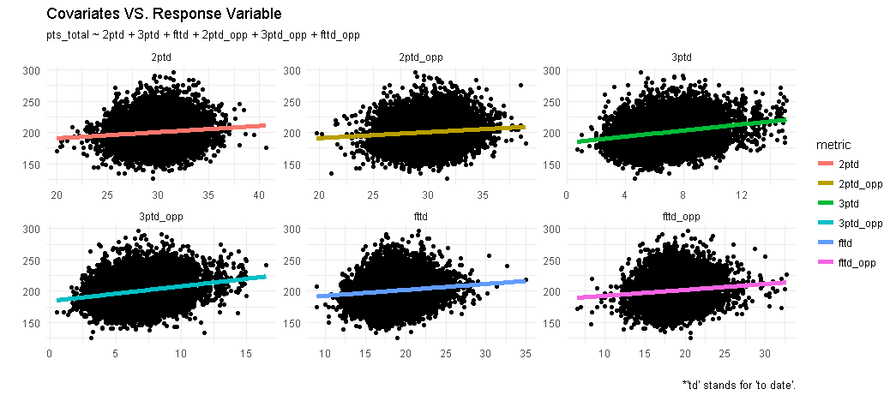
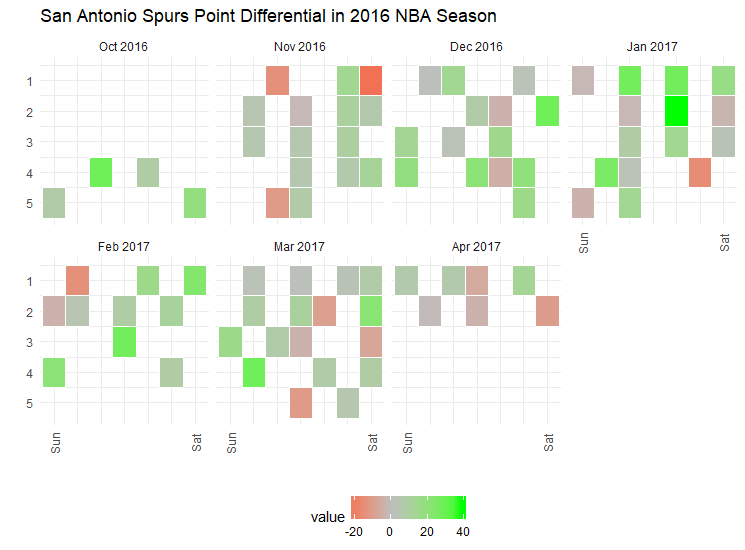

# Introduction

This project is under active development. It includes scripts for scraping,
"munging", and analyzing data from
<https://www.basketball-reference.com>.
So far, creating machine learning models
to predict season win totals has been the major focus of the analysis scripts.
However, plenty of other exploratory kinds of analysis have also been done.

# Highlights

Here are some examples of things I've evaluated in this project.

## Accuracy of classification models in predicting season win totals

## Effects of home court advantage and rest (in a study of endogenuous variables)

## Points-per-game (ppg) metrics as predictors (in a linear regression model)

## Point differential of a specific team in a given season

# Notes to Self

This project also serves as a mirror of my local "manual"
workbook for tracking the NBA predictions that my brother and I make
on a seasonal basis. (See the `db_nba.xlsm` file in the `data` folder).
